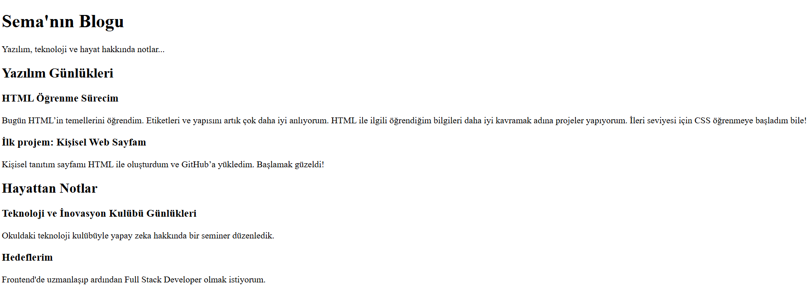

# 📝 Basit Blog Sayfası

Bu proje, yalnızca HTML kullanılarak oluşturulmuş basit ve statik bir blog sayfasıdır. Frontend öğrenme sürecinde temel HTML etiketleriyle içerik yapılandırmayı ve anlamlı bir sayfa düzeni oluşturmayı hedeflemektedir.

## 🔍 Sayfa Özellikleri

- `<header>`, `<main>`, `<section>` ve `<article>` etiketleriyle semantik yapı
- 2 ana bölüm: **Yazılım Günlükleri** ve **Hayattan Notlar**
- Her yazı için ayrı bir `<article>` yapısı
- Sade ve okunabilir içerik yapısı

## 📸 Ekran Görüntüsü

